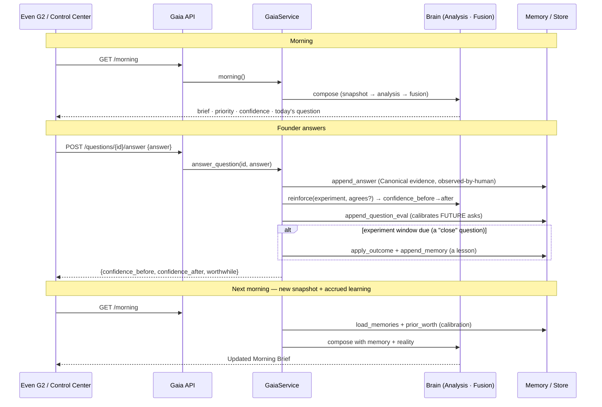

# Sprint 14 — Founder Pilot (integration & debugging audit)

No new features, no redesign. Every claim below was **verified against the running system**
(live API, real browser, real workbooks) — not assumed.

---

## 1. "Answer today's question" — fixed

**Exact failure (reproduced in a real browser):** the whole backend chain worked —
`POST /questions/{id}/answer` reached `GaiaService.answer_question`, the lifecycle recorded the
answer + `question_eval` and reinforced the experiment confidence, and the response returned
`{confidence_before, confidence_after, worthwhile}`. The bug was purely presentation:
`answer()` wrote the confirmation into `#q`, then immediately called `refresh()` which
re-rendered `#q` with the regenerated question — wiping the confirmation in <1 s — **and never
cleared the input**. The founder saw the input still full and the same question → "Send does
nothing." (`if(!QID) return` and a missing try/catch made other paths silent too.)

**Fix** (`api/web.py`, presentation only): confirmation moved to its own `#qmsg` element (the
question auto-refresh can no longer wipe it); input cleared on success; Send/Add disabled during
the request; every previously-silent path now shows a message (no question / empty input / API
error). **Verified in-browser:** `Answered ✓ confidence Low → Low (worthwhile)` persists, input
clears; empty answer → `Type your answer first.`; a note → `Noted ✓ — saved as an observation.`

## 2. Every POST endpoint — reachable, correct, crash-proof

| Endpoint | Status | Exercised by | Bad input |
|---|---|---|---|
| `POST /observations` | 201 | DJI/camera/Lovable; founder via voice-notes | unknown fields → `{accepted:0,rejected:1}`; invalid JSON → 400 |
| `POST /voice-notes` | 201 `accepted:true` | Control Center ✓, glasses note | — |
| `POST /questions/{id}/answer` | 200 | Control Center ✓ (fixed) | unknown id → `{error}` (200, honest) |
| `POST /ask` | 200 | Even G2 voice | missing keys → honest message (200) |

There is **no `POST /memory`** by design — memory is append-only via the lifecycle (answering a
"close" question → `append_memory`; voice notes → observations). Nothing silently fails.

## 3. Founder scenario — sequence diagram (verified)

**Verified reality (important, no overstatement):** answering today's "confirm" question is
recorded as Canonical evidence (observation count grew 50→…), logs a `question_eval`
(`worthwhile:true`) and reinforces the open experiment's confidence. **Memory (lessons) and
calibration (hold-rate) only change when an experiment *closes*** — a window-due "close"
question, typically the next day. So the **"Updated Morning Brief" is a next-morning effect**
(new snapshot + accrued learning), not an instant re-render. The loop is real and closed; it is
just diurnal, which is correct for a greenhouse.

## 4. Even G2 chain — status & blockers

| Hop | Verified | Blocker |
|---|---|---|
| Even G2 → Even Hub plugin | ✅ loads via dev QR | `.ehpk` not uploaded → needs **Even developer login** for a permanent OTA install (else dev-server + scan each session) — *credential/hardware* |
| Even Hub plugin → Gaia API | ✅ Vite `/gaia` proxy (dev) / CORS (prod) | off-LAN needs a **hosted API + TLS** |
| Gaia API → Brain | ✅ `/morning`, `/ask` live | — |
| Brain → response | ✅ grounded answers | — |
| response → Even Hub → G2 display | ✅ HUD renders | — |
| Speech round-trip | ✅ STT + Claude, **~7–10 s** | latency (Opus); `GAIA_ANSWER_MODEL=claude-sonnet-4-6` trades depth for speed |
| Proactive alerts | ❌ not possible | Even Hub has **no background/push** — foreground glanceable only (platform limit) |
| Founder *input* (answer / note) from glasses | ❌ not wired | the G2 app calls only `/morning` + `/ask`; answering the day's question and capturing observations exist **only in the Control Center** |

## 5. Voice pipeline — WhisperFlow

STT is now a **server-side, swappable provider** (`GAIA_STT_PROVIDER=openai|whisperflow`).
Clients never transcribe — the glasses only stream PCM. To switch to WhisperFlow:
`GAIA_STT_PROVIDER=whisperflow`, `WHISPERFLOW_URL=<endpoint>` (+ optional `WHISPERFLOW_API_KEY`,
`WHISPERFLOW_MODEL`). The provider posts the WAV as OpenAI-compatible multipart and reads
`{text}`. **Remaining (blocked):** WhisperFlow's real endpoint URL + credentials, and
confirmation its wire shape is OpenAI-compatible; if it differs, `_stt_whisperflow` in
`api/ask.py` is the single point to adapt. Default stays `openai` (verified working).

## 6. Synopta — exactly what's required to go live (audited, no assumptions)

`fixture` is the default in **one logical place** — `Config.source` (`GAIA_SOURCE`, default
`"fixture"`) and the `make_source` factory, used by `collector/collect.py`. **What already
exists and was verified working:**

- **Parser** — `collector/translate.py` turns a raw Synopta export into Canonical Observations
  (`source: synopta`, `method: measured`). ✅
- **Source seam** — `SynoptaSource` (abstract `fetch()`), with `FixtureSource` and
  **`DropFolderSource`** (reads the newest `*.json` from a folder). ✅
- **Scheduler** — `api/run.py` runs a collection loop every `GAIA_COLLECT_INTERVAL_MIN`. ✅
- **Proof:** dropping a Synopta-shaped export into a folder and running
  `collect(source="drop-folder", path=…)` **published a canonical snapshot (11 observations,
  84.6 % coverage)** — no new code.

So switching to live Synopta depends only on *how Synopta exposes data*:

| Need | If Synopta exports **files** (USB/share/Drive sync) | If Synopta is an **API** |
|---|---|---|
| credentials | folder read access only | a **Synopta API key / login** (not present) |
| endpoint | none | the **Synopta endpoint URL** (not present) |
| observer/source | **none** — `DropFolderSource` exists; set `GAIA_SOURCE=drop-folder`, `GAIA_DROP_PATH=<folder>` | a new `SynoptaApiSource(SynoptaSource)` implementing `fetch()` (≈30 lines) |
| parser | `translate.py` exists — **but built from a captured fixture**; must be verified against one *real* export and adjusted if the field shapes differ | same |
| scheduler | exists | exists |

**The one unknown to resolve (a real blocker, not a guess):** does Kålaberga's Synopta deliver a
**file export** or a **live API**? That single answer determines whether going live is pure
config (file path) or ~30 lines of source code + an endpoint/key. Either way the parser must be
checked against one real export.

## 7. Founder readiness — can Oskar spend an entire greenhouse day wearing only Even G2?

**Not yet.** He can already, glasses-only: read the Morning Brief and **talk to Gaia** (ask a
question, get a grounded spoken→text answer). What prevents a *full day* on G2 alone, ranked by
value:

1. **Gaia runs on a demonstration greenhouse, not reality (`source=fixture`).** A full real day
   needs live Synopta (§6). Highest value — without it the day's brief and answers describe mock
   data. *Blocked on:* Synopta's delivery method + one real export.
2. **The glasses can't take the founder's input back to Gaia.** Answering the day's question and
   logging observations exist only in the Control Center; the G2 app does brief + `/ask` only.
   So the learning loop (§3) can't be closed glasses-only. *This is wiring the existing
   `/voice-notes` and `/questions/answer` endpoints into the glasses voice flow — endpoints
   verified; not yet on the glasses.*
3. **No permanent install.** The app loads via the Mac's dev server + a QR scan each session;
   a standalone OTA install needs the `.ehpk` uploaded. *Blocked on:* Even developer login.
4. **Voice latency ~7–10 s** per round-trip on Opus. Usable, not snappy. *Mitigation in hand:*
   `GAIA_ANSWER_MODEL=claude-sonnet-4-6`.
5. **No proactive alerts.** Even Hub has no background push, so Gaia can't get the founder's
   attention — he must open the app. *Platform limit, not fixable here.*
6. **LAN-only.** Off the greenhouse Wi-Fi needs a hosted API + TLS.

Blockers #1, #3, #4 (env/credentials/config) and #5, #6 (platform/hosting) are outside code;
#2 is the one integration gap that would most expand glasses-only usefulness and uses only
endpoints that already work.
